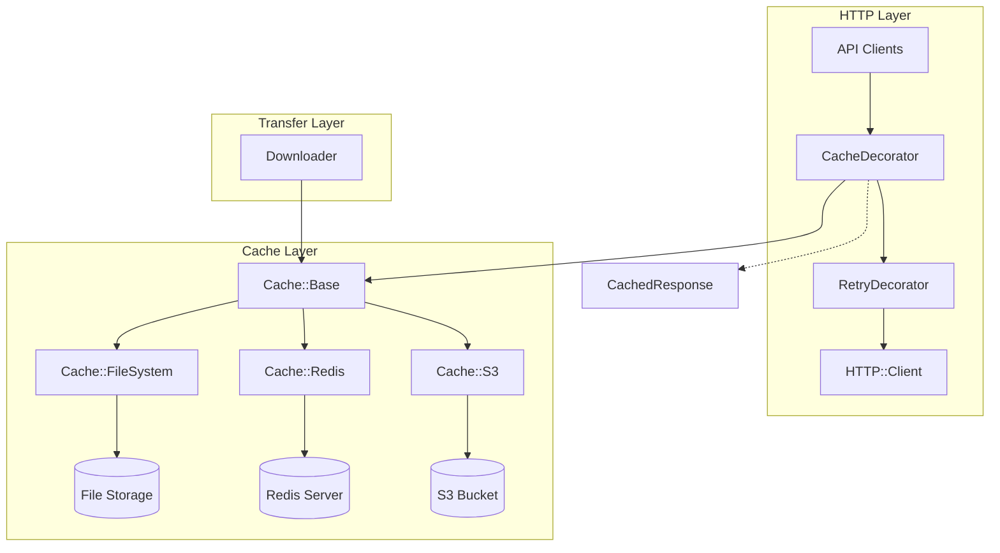
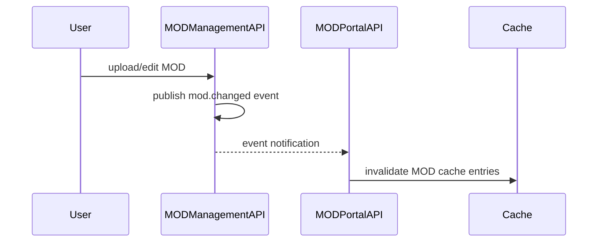

# Cache System

Multi-backend caching infrastructure for MOD files, API responses, and metadata.

## Overview

Factorix uses a pluggable cache backend system with a common abstract interface (`Cache::Base`). Three specialized cache instances are configured with settings optimized for different data types:

| Cache | Purpose | TTL | Compression |
|-------|---------|-----|-------------|
| `download_cache` | MOD files (.zip) | Unlimited | Disabled |
| `api_cache` | API JSON responses | 3600s (1 hour) | Always |
| `info_json_cache` | MOD metadata (info.json) | Unlimited | Always |

**Design rationale:**
- MOD files are immutable (version-specific), so unlimited TTL is safe
- API responses may change (new releases, metadata updates), so TTL expiration is required
- info.json is extracted from immutable MOD archives, so unlimited TTL is safe
- Compression is disabled for binary MOD files (already compressed), enabled for JSON (high compression ratio)

## Architecture



### Components

| Class | Responsibility |
|-------|----------------|
| `Cache::Base` | Abstract interface defining the cache contract |
| `Cache::Entry` | Data class representing cache entry metadata |
| `Cache::FileSystem` | File-based backend with compression and locking |
| `Cache::Redis` | Redis-based backend with distributed locking |
| `Cache::S3` | S3-based backend with distributed locking |
| `HTTP::CacheDecorator` | HTTP response caching (decorator pattern) |
| `HTTP::CachedResponse` | Cached response wrapper |

## Base Class

Location: `lib/factorix/cache/base.rb`

Abstract base class that defines the cache backend interface. All cache backends must inherit from this class and implement its abstract methods.

### Public API

| Method | Description |
|--------|-------------|
| `exist?(key)` | Check if entry exists and is not expired |
| `read(key, encoding)` | Read cached content as string |
| `write_to(key, output)` | Write cached content to file |
| `store(key, src)` | Store file in cache |
| `delete(key)` | Delete specific entry |
| `clear()` | Clear all entries |
| `age(key)` | Get entry age in seconds |
| `expired?(key)` | Check if entry exceeded TTL |
| `size(key)` | Get cached file size |
| `with_lock(key)` | Execute block with exclusive lock |
| `each` | Enumerate cache entries |

### Common Behaviors

- **TTL**: Configurable time-to-live in seconds; `nil` means unlimited
- **Exclusive locking**: `with_lock` prevents concurrent operations on the same key (implementation varies by backend)

### Entry Data Class

Location: `lib/factorix/cache/entry.rb`

```ruby
Entry = Data.define(:size, :age, :expired)
```

Represents metadata about a cache entry, used when enumerating entries with `#each`.

## FileSystem Class

Location: `lib/factorix/cache/file_system.rb`

File-based cache backend that extends `Cache::Base`. Provides persistent storage with optional compression and process-safe file locking.

### Storage Format

Keys are hashed using SHA1, and stored in a two-level directory structure using the first 2 characters of the hash as a subdirectory:

```
cache_dir/
├── ab/
│   └── cdef1234567890...  # Remaining hash after first 2 chars
├── 12/
│   └── 3456789abcdef0...
└── ...
```

This prevents filesystem overload from too many files in a single directory.

### Compression

Controlled by `compression_threshold` parameter:

| Value | Behavior |
|-------|----------|
| `nil` | No compression |
| `N` | Compress if size >= N bytes (0 means always compress) |

- Uses zlib compression
- Auto-detects compression on read via CMF byte validation (`0x78`)
- Transparent to callers (compression/decompression is automatic)

### Locking

- Uses `flock()` for process-safe exclusive locking
- Blocks until lock is acquired (no timeout)
- Stale lock cleanup: removes lock files older than 3600 seconds

## Redis Class

Location: `lib/factorix/cache/redis.rb`

Redis-based cache backend that extends `Cache::Base`. Provides distributed caching with automatic TTL management and distributed locking via Lua scripts.

### Dependencies

The `redis` gem is required but not included in the gemspec (optional dependency). Users must add it to their Gemfile:

```ruby
gem "redis", "~> 5"
```

### Key Structure

Keys are auto-namespaced based on cache type:

```
factorix-cache:{cache_type}:{key}           # Data
factorix-cache:{cache_type}:meta:{key}      # Metadata (size, created_at)
factorix-cache:{cache_type}:lock:{key}      # Distributed lock
```

Example:
```
factorix-cache:api:https://mods.factorio.com/api/mods/example
factorix-cache:api:meta:https://mods.factorio.com/api/mods/example
factorix-cache:api:lock:https://mods.factorio.com/api/mods/example
```

### Metadata Storage

Redis doesn't natively store creation time or size, so metadata is stored in separate hash keys:

```ruby
@redis.hset(meta_key, "size", data.bytesize, "created_at", Time.now.to_i)
```

### TTL Handling

Redis handles TTL natively with EXPIRE command:
- Keys automatically disappear after TTL
- Metadata keys expire with same TTL as data keys
- `expired?` returns `true` for non-existent keys

### Distributed Locking

Uses Redis SET NX EX pattern with Lua script for atomic release:

```ruby
# Acquire lock
@redis.set(lock_key, uuid, nx: true, ex: LOCK_TTL)

# Release lock atomically (only if we own it)
release_script = <<~LUA
  if redis.call("get", KEYS[1]) == ARGV[1] then
    return redis.call("del", KEYS[1])
  else
    return 0
  end
LUA
@redis.eval(release_script, keys: [lock_key], argv: [uuid])
```

- Lock acquired with unique UUID value
- Lock released only if still owned (prevents releasing others' locks)
- Configurable timeout for lock acquisition (`lock_timeout` parameter)
- Raises `LockTimeoutError` if lock cannot be acquired within timeout

## S3 Class

Location: `lib/factorix/cache/s3.rb`

S3-based cache backend that extends `Cache::Base`. Provides distributed caching with TTL via object metadata and distributed locking via conditional PUT.

### Dependencies

The `aws-sdk-s3` gem is required but not included in the gemspec (optional dependency). Users must add it to their Gemfile:

```ruby
gem "aws-sdk-s3"
```

### Key Structure

Keys are hashed using SHA1 to avoid deep directory structures from URL slashes:

```
cache/{cache_type}/{sha1_hash}           # Data object
cache/{cache_type}/{sha1_hash}.lock      # Lock object
```

The original logical key is stored in object metadata (`logical-key`) for enumeration.

### TTL Handling

TTL is managed via S3 object metadata:
- Expiration timestamp stored in `expires-at` metadata
- Age calculated from S3 native `Last-Modified` timestamp
- `expired?` checks metadata against current time

### Distributed Locking

Uses conditional PUT with `if_none_match: "*"` for lock acquisition:

- Lock object contains UUID and expiration timestamp
- Lock released by deleting the lock object
- Stale lock cleanup based on expiration in lock content
- Configurable timeout for lock acquisition (`lock_timeout` parameter)
- Raises `LockTimeoutError` if lock cannot be acquired within timeout

### Required IAM Permissions

```json
{
  "Version": "2012-10-17",
  "Statement": [{
    "Effect": "Allow",
    "Action": [
      "s3:GetObject",
      "s3:PutObject",
      "s3:DeleteObject",
      "s3:ListBucket",
      "s3:HeadObject"
    ],
    "Resource": [
      "arn:aws:s3:::YOUR-BUCKET-NAME",
      "arn:aws:s3:::YOUR-BUCKET-NAME/*"
    ]
  }]
}
```

## HTTP Cache Decorator

Location: `lib/factorix/http/cache_decorator.rb`

### Caching Rules

- **Cached**: Non-streaming GET requests (no block)
- **Not cached**: Streaming requests (with block), POST, PUT, DELETE

### Caching Flow

1. Check if cached copy exists
2. If hit: return `CachedResponse`, publish `cache.hit` event
3. If miss: acquire exclusive lock on cache key
4. Double-check cache (another process may have filled it)
5. Execute HTTP request
6. If successful (2xx): store response body via temporary file
7. Publish `cache.miss` event
8. Return response

### Event Publishing

| Event | Payload | Description |
|-------|---------|-------------|
| `cache.hit` | `{url:}` | Cache hit occurred |
| `cache.miss` | `{url:}` | Cache miss, request executed |

## Event-Driven Cache Invalidation

When MOD metadata changes on the portal, cached data must be invalidated.

### Event Flow



### Trigger Operations

`MODManagementAPI` publishes `mod.changed` event after:
- `finish_upload()` - MOD published or updated
- `edit_details()` - Metadata edited
- `finish_image_upload()` - Image added
- `edit_images()` - Image list modified

### Invalidation Logic

`MODPortalAPI` subscribes and invalidates both endpoints:
- `/api/mods/{mod_name}` - Basic MOD info
- `/api/mods/{mod_name}/full` - Full MOD info with releases

## CLI Commands

See [`cli.md`](cli.md) for cache management commands:
- `factorix cache stat` - Display cache statistics
- `factorix cache evict` - Remove cache entries

## Related Documentation

- [`configuration.md`](configuration.md) - Cache settings and backend configuration
- [`cli.md`](cli.md) - Cache CLI commands
- [`http.md`](http.md) - HTTP decorator chain
- [`runtime.md`](runtime.md) - Cache directory paths (`xdg_cache_home_dir`)
