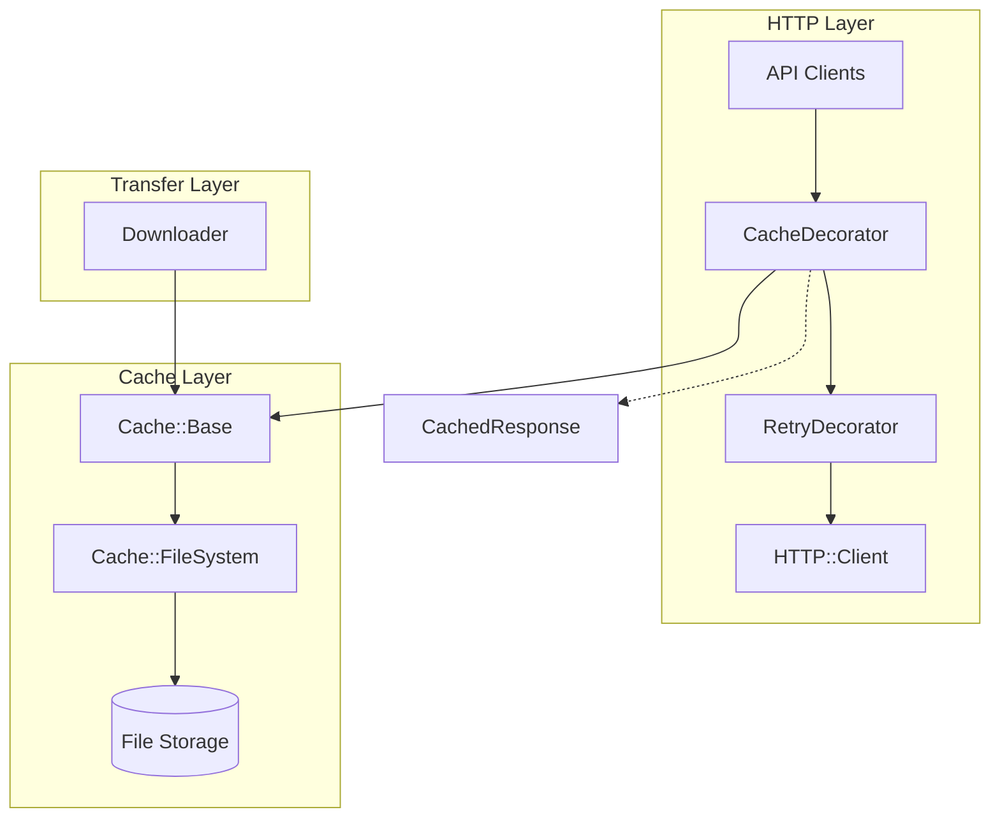

# Cache System

Multi-backend caching infrastructure for MOD files, API responses, and metadata.

## Overview

Factorix uses a pluggable cache backend system with a common abstract interface (`Cache::Base`). Three specialized cache instances are configured with settings optimized for different data types:

| Cache | Purpose | TTL | Compression |
|-------|---------|-----|-------------|
| `download_cache` | MOD files (.zip) | Unlimited | Disabled |
| `api_cache` | API JSON responses | 3600s (1 hour) | Always |
| `info_json_cache` | MOD metadata (info.json) | Unlimited | Always |

**Design rationale:**
- MOD files are immutable (version-specific), so unlimited TTL is safe
- API responses may change (new releases, metadata updates), so TTL expiration is required
- info.json is extracted from immutable MOD archives, so unlimited TTL is safe
- Compression is disabled for binary MOD files (already compressed), enabled for JSON (high compression ratio)

## Architecture



### Components

| Class | Responsibility |
|-------|----------------|
| `Cache::Base` | Abstract interface defining the cache contract |
| `Cache::Entry` | Data class representing cache entry metadata |
| `Cache::FileSystem` | File-based backend with compression and locking |
| `HTTP::CacheDecorator` | HTTP response caching (decorator pattern) |
| `HTTP::CachedResponse` | Cached response wrapper |

## Base Class

Location: `lib/factorix/cache/base.rb`

Abstract base class that defines the cache backend interface. All cache backends must inherit from this class and implement its abstract methods.

### Public API

| Method | Description |
|--------|-------------|
| `exist?(key)` | Check if entry exists and is not expired |
| `read(key, encoding)` | Read cached content as string |
| `write_to(key, output)` | Write cached content to file |
| `store(key, src)` | Store file in cache |
| `delete(key)` | Delete specific entry |
| `clear()` | Clear all entries |
| `age(key)` | Get entry age in seconds |
| `expired?(key)` | Check if entry exceeded TTL |
| `size(key)` | Get cached file size |
| `with_lock(key)` | Execute block with exclusive lock |
| `each` | Enumerate cache entries |

### Entry Data Class

Location: `lib/factorix/cache/entry.rb`

```ruby
Entry = Data.define(:size, :age, :expired)
```

Represents metadata about a cache entry, used when enumerating entries with `#each`.

## FileSystem Class

Location: `lib/factorix/cache/file_system.rb`

File-based cache backend that extends `Cache::Base`. Provides persistent storage with optional compression and process-safe file locking.

### Storage Format

Two-level directory structure to prevent filesystem overload:

```
cache_dir/
├── ab/
│   └── cdef1234567890...  # Full key after first 2 chars
├── 12/
│   └── 3456789abcdef0...
└── ...
```

### Key Generation

Cache keys are generated using SHA1 hash of the full URL:

```ruby
key = cache.key_for("https://mods.factorio.com/api/mods/example")
# => "a1b2c3d4e5f6..."
```

### Compression

Controlled by `compression_threshold` parameter:

| Value | Behavior |
|-------|----------|
| `nil` | No compression |
| `0` | Always compress |
| `N` | Compress if size >= N bytes |

- Uses zlib compression
- Auto-detects compression on read via CMF byte validation (`0x78`)
- Transparent to callers (compression/decompression is automatic)

### File Locking

- Uses `flock()` for process-safe exclusive locking
- Prevents concurrent downloads of same resource
- Stale lock cleanup: removes locks older than 3600 seconds
- Double-check pattern in CacheDecorator ensures cache consistency

## HTTP Cache Decorator

Location: `lib/factorix/http/cache_decorator.rb`

### Caching Rules

- **Cached**: Non-streaming GET requests (no block)
- **Not cached**: Streaming requests (with block), POST, PUT, DELETE

### Caching Flow

1. Check if cached copy exists
2. If hit: return `CachedResponse`, publish `cache.hit` event
3. If miss: acquire exclusive lock on cache key
4. Double-check cache (another process may have filled it)
5. Execute HTTP request
6. If successful (2xx): store response body via temporary file
7. Publish `cache.miss` event
8. Return response

### Event Publishing

| Event | Payload | Description |
|-------|---------|-------------|
| `cache.hit` | `{uri:}` | Cache hit occurred |
| `cache.miss` | `{uri:}` | Cache miss, request executed |

## Event-Driven Cache Invalidation

When MOD metadata changes on the portal, cached data must be invalidated.

### Event Flow


### Trigger Operations

`MODManagementAPI` publishes `mod.changed` event after:
- `finish_upload()` - MOD published or updated
- `edit_details()` - Metadata edited
- `finish_image_upload()` - Image added
- `edit_images()` - Image list modified

### Invalidation Logic

`MODPortalAPI` subscribes and invalidates both endpoints:
- `/api/mods/{mod_name}` - Basic MOD info
- `/api/mods/{mod_name}/full` - Full MOD info with releases

## Configuration

Location: `lib/factorix.rb`

### Cache Settings

Each cache type has a `backend` selector and backend-specific nested settings:

```ruby
setting :cache do
  setting :download do
    setting :backend, default: :file_system        # Backend selector
    setting :ttl, default: nil                     # Unlimited
    setting :file_system do                        # FileSystem-specific settings
      setting :dir, constructor: ->(v) { v ? Pathname(v) : nil }
      setting :max_file_size, default: nil         # Unlimited
      setting :compression_threshold, default: nil # No compression
    end
  end

  setting :api do
    setting :backend, default: :file_system
    setting :ttl, default: 3600                    # 1 hour
    setting :file_system do
      setting :dir, constructor: ->(v) { v ? Pathname(v) : nil }
      setting :max_file_size, default: 10 * 1024 * 1024  # 10MiB
      setting :compression_threshold, default: 0   # Always compress
    end
  end

  setting :info_json do
    setting :backend, default: :file_system
    setting :ttl, default: nil                     # Unlimited
    setting :file_system do
      setting :dir, constructor: ->(v) { v ? Pathname(v) : nil }
      setting :max_file_size, default: nil         # Unlimited
      setting :compression_threshold, default: 0   # Always compress
    end
  end
end
```

### DI Container Registration

The container resolves cache instances based on the configured backend:

```ruby
register(:download_cache, memoize: true) do
  build_cache(:download)  # Resolves to configured backend
end

register(:api_cache, memoize: true) do
  build_cache(:api)
end

register(:info_json_cache, memoize: true) do
  build_cache(:info_json)
end
```

## CLI Commands

See [`cli.md`](cli.md) for cache management commands:
- `factorix cache stat` - Display cache statistics
- `factorix cache evict` - Remove cache entries

## Related Documentation

- [`cli.md`](cli.md) - Cache CLI commands
- [`http.md`](http.md) - HTTP decorator chain
- [`runtime.md`](runtime.md) - Cache directory paths (`xdg_cache_home_dir`)
- [`api-portal.md`](api-portal.md) - Cache key optimization for API calls
