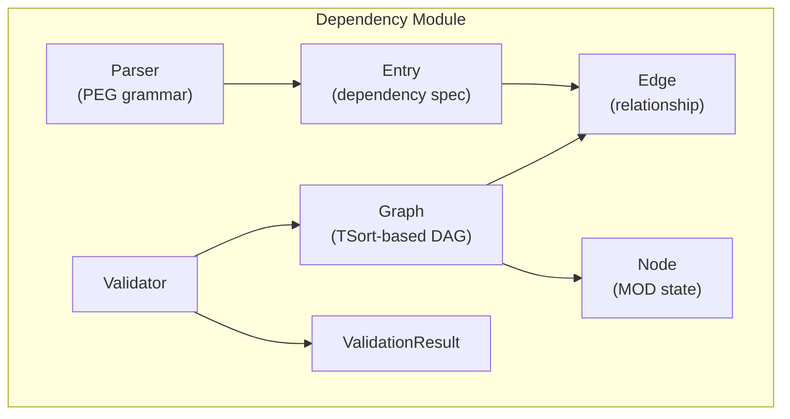
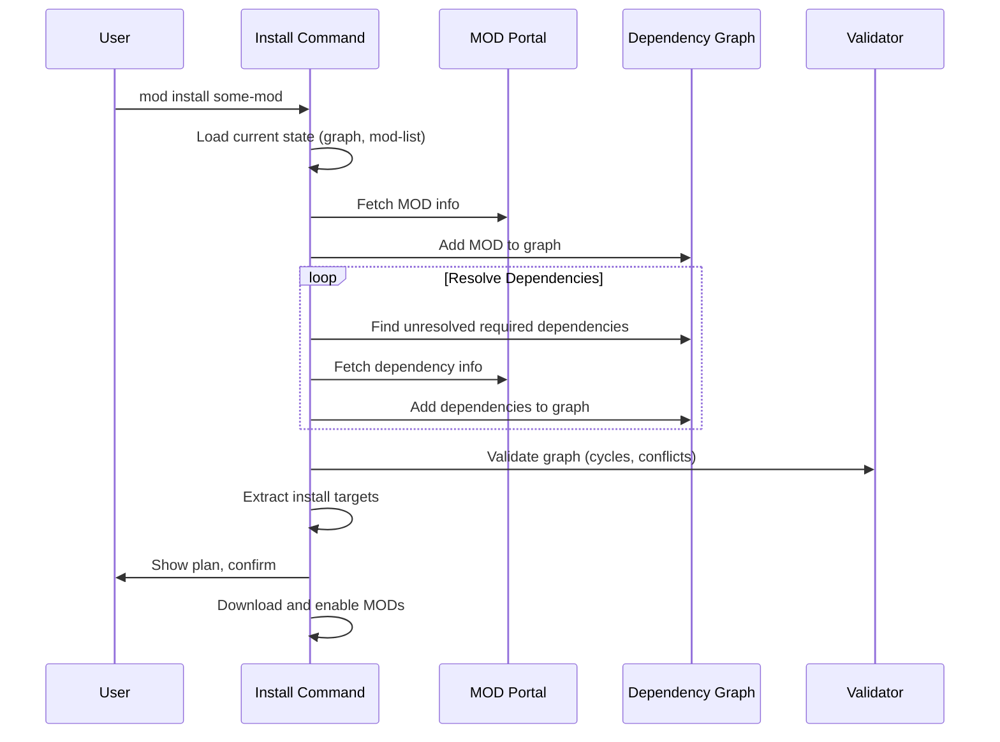
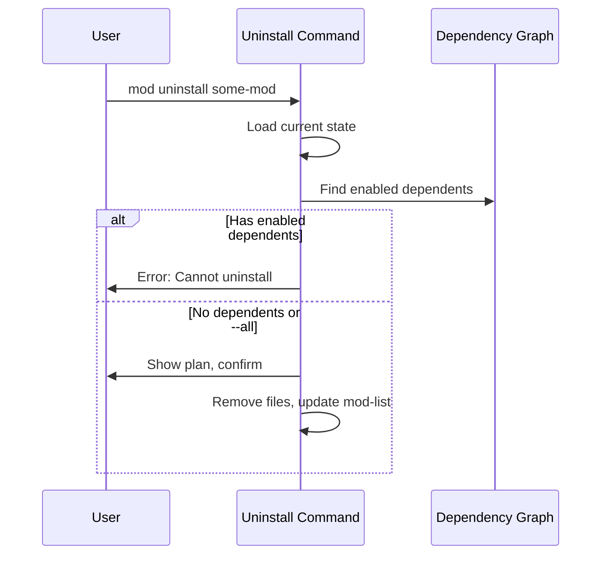

# Dependency Resolution

## Overview

The `Factorix::Dependency` module provides graph-based dependency resolution for Factorio MODs. It handles dependency parsing, graph construction, topological sorting, cycle detection, and validation.

## Architecture



## Core Components

### Parser

Parses Factorio dependency strings using a PEG-based grammar (Parslet).

**Dependency String Format:**

| Prefix | Type | Description |
|--------|------|-------------|
| (none) | Required | Must be installed and enabled |
| `?` | Optional | Loaded if available |
| `(?)` | Hidden Optional | Like optional, hidden from users |
| `!` | Incompatible | Cannot be enabled together |
| `~` | Load Neutral | No load order constraint |

**Version Operators:** `>=`, `<=`, `>`, `<`, `=`

```ruby
parser = Dependency::Parser.new
parser.parse("base")                    # Required
parser.parse("? some-mod >= 1.2.0")     # Optional with version
parser.parse("! bad-mod")               # Incompatible
parser.parse("(?) hidden-mod")          # Hidden optional
parser.parse("~ neutral-mod")           # Load neutral
```

### Entry

Immutable data class representing a parsed dependency specification.

```ruby
Entry = Data.define(:mod, :type, :version_requirement)
```

**Methods:**
- `required?`, `optional?`, `incompatible?`, `load_neutral?`
- `satisfied_by?(version)` - Check version compatibility

### Graph

Directed graph using Ruby's `TSort` module for cycle detection.

```ruby
graph = Dependency::Graph.new
graph.add_node(node)
graph.add_edge(edge)
graph.cyclic?                        # Detect circular dependencies
graph.strongly_connected_components  # Get cycles for error reporting
```

**Key Features:**
- Only required dependencies are followed for cycle detection
- Optional cycles are allowed (Factorio permits them)

### Node

Represents a MOD in the dependency graph.

```ruby
Node = Data.define(:mod, :version, :enabled, :installed, :operation)
```

- `operation`: `:none`, `:install`, `:enable`, `:disable`, `:uninstall`

### Edge

Represents a dependency relationship between two MODs.

```ruby
Edge = Data.define(:from_mod, :to_mod, :type, :version_requirement)
```

### Validator

Performs comprehensive validation of MOD dependencies:

1. **Circular Dependencies** - Detects and reports cycles
2. **Missing Dependencies** - Required MODs not installed
3. **Disabled Dependencies** - Required MODs not enabled
4. **Version Mismatches** - Version requirements not satisfied
5. **Conflicts** - Incompatible MODs both enabled

## Installation Flow

The `mod install` command uses dependency resolution:



**Key Points:**
- Only required dependencies are automatically resolved
- Optional dependencies are NOT auto-installed
- Cycles and conflicts are detected before installation

## Uninstallation Flow

The `mod uninstall` command prevents breaking dependencies:



**Key Points:**
- Cannot uninstall if enabled MODs depend on it
- Base MOD cannot be uninstalled
- Expansion MODs are disabled, not uninstalled

## Validation Types

| Type | Description |
|------|-------------|
| `CIRCULAR_DEPENDENCY` | Cycle detected in required dependencies |
| `MISSING_DEPENDENCY` | Required MOD not installed |
| `DISABLED_DEPENDENCY` | Required MOD not enabled |
| `VERSION_MISMATCH` | Installed version doesn't satisfy requirement |
| `CONFLICT` | Incompatible MODs both enabled |
| `MOD_IN_LIST_NOT_INSTALLED` | Warning: in mod-list but not installed |
| `MOD_INSTALLED_NOT_IN_LIST` | Warning: installed but not in mod-list |

## Related Documentation

- [CLI Commands](cli.md) - `mod install`, `mod uninstall`, `mod check`
- [Storage](storage.md) - MOD installation and mod-list.json
- [Architecture](../architecture.md) - Overall system design
