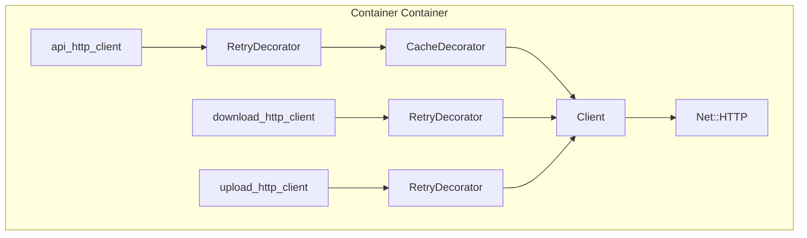
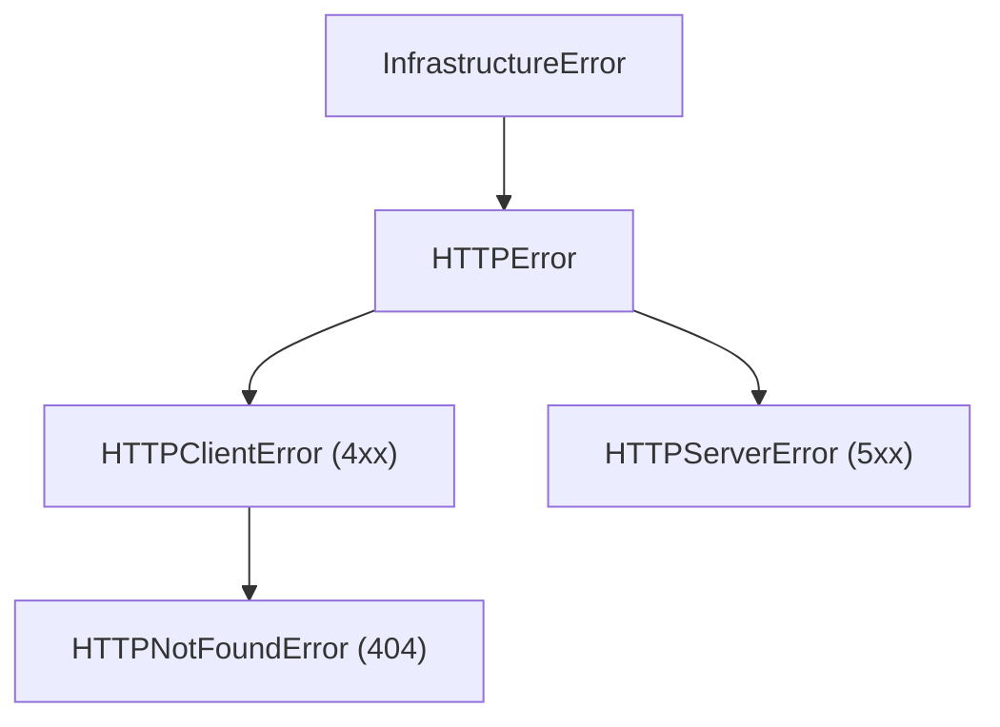

# HTTP Module

Low-level HTTP infrastructure for all network communication.

## Architecture



## Components

### Client

Core HTTP client using `Net::HTTP`.

**Responsibilities**:
- Create and configure `Net::HTTP` instances
- Execute HTTP methods (GET, POST)
- Handle redirects (up to 10)
- Parse response codes and raise appropriate errors
- Support streaming for large files

**Methods**:
- `request(method, uri, headers:, body:, &block)` - General request
- `get(uri, headers:, &block)` - GET request
- `post(uri, body:, headers:, content_type:)` - POST request

**Constraints**:
- HTTPS only (raises `URLError` for non-HTTPS)

### Response

Simple wrapper for `Net::HTTPResponse`.

**Attributes**:
- `code` - HTTP status code (Integer)
- `body` - Response body (String)
- `headers` - Response headers (Hash)
- `raw_response` - Original `Net::HTTPResponse`

**Methods**:
- `success?` - Returns true for 2xx responses
- `content_length` - Content-Length header value

### CachedResponse

Response wrapper for cached data.

Provides same interface as `Response` for cached content. Always returns `success? = true` since only successful responses are cached.

### RetryDecorator

Adds automatic retry with exponential backoff.

Wraps HTTP client and retries requests on network errors using `RetryStrategy`. Implements same interface as `Client`.

### RetryStrategy

Manages retry logic with exponential backoff.

**Default Configuration**:
- `tries: 3` - Total attempts (including initial)
- `base_interval: 1.0` - Initial wait (seconds)
- `multiplier: 2.0` - Exponential factor
- `rand_factor: 0.25` - Randomization

**Retried Exceptions**:
- `Errno::ETIMEDOUT`
- `Errno::ECONNRESET`
- `Errno::ECONNREFUSED`
- `Net::OpenTimeout`
- `Net::ReadTimeout`
- `SocketError`
- `OpenSSL::SSL::SSLError`
- `EOFError`

### CacheDecorator

Adds caching for GET requests. See [`cache.md`](cache.md) for detailed cache architecture.

**Behavior**:
- Only caches non-streaming GET requests (no block given)
- Uses configured cache backend for storage
- Thread-safe with locking
- Publishes `cache.hit` and `cache.miss` events

**Methods**:
- `get(uri, headers:, &block)` - Cached GET
- `post(...)` - Passed through (never cached)

## Client Variants

Registered in `Container` container with different decorator stacks:

| Client | Decorators | Use Case |
|--------|------------|----------|
| `http_client` | None | Base client |
| `api_http_client` | Retry + Cache | API calls |
| `download_http_client` | Retry | File downloads |
| `upload_http_client` | Retry | File uploads |

## Error Hierarchy



**HTTPClientError** attributes:
- `api_error` - Error code from API response JSON
- `api_message` - Error message from API response JSON

## Usage Examples

### Direct Client Usage

```ruby
client = Factorix::Container[:api_http_client]

# GET request
response = client.get(URI("https://mods.factorio.com/api/mods"))
data = JSON.parse(response.body)

# POST request
response = client.post(
  URI("https://mods.factorio.com/api/v2/mods/edit_details"),
  body: URI.encode_www_form(mod: "my-mod", title: "New Title"),
  content_type: "application/x-www-form-urlencoded"
)
```

### Streaming Download

```ruby
client = Factorix::Container[:download_http_client]

client.get(download_uri) do |response|
  File.open(output_path, "wb") do |file|
    response.read_body do |chunk|
      file.write(chunk)
    end
  end
end
```

## Related Documentation

- [API and Portal Layers](api-portal.md)
- [Cache System](cache.md)
- [Configuration](configuration.md)
- [Container (DI)](container.md)
