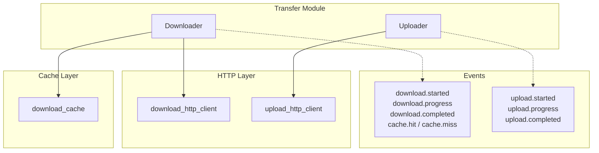

# Transfer Module

High-level file transfer operations with progress tracking and caching.

## Architecture



## Components

### Downloader

File downloader with caching and progress tracking.

**Features**:
- Automatic caching with `Cache::FileSystem`
- SHA1 verification (optional)
- File locking to prevent concurrent downloads
- Progress events via `Dry::Events`
- Credential masking in logs

**Method**:

```ruby
download(url, output, expected_sha1: nil)
```

| Parameter | Type | Description |
|-----------|------|-------------|
| `url` | `URI::HTTPS` | Download URL (HTTPS only) |
| `output` | `Pathname` | Output file path |
| `expected_sha1` | `String, nil` | Expected SHA1 for verification |

**Events**:

| Event | Payload |
|-------|---------|
| `download.started` | `total_size:` |
| `download.progress` | `current_size:`, `total_size:` |
| `download.completed` | `total_size:` |
| `cache.hit` | `url:`, `output:`, `total_size:` |
| `cache.miss` | `url:` |

**Cache Behavior**:
1. Check cache for existing file
2. If cached, verify SHA1 (if provided)
3. If SHA1 mismatch, invalidate cache and re-download
4. Use file locking to prevent concurrent downloads
5. Store downloaded file in cache

**Errors**:
- `URLError` - Non-HTTPS URL
- `HTTPClientError` - 4xx HTTP errors
- `HTTPServerError` - 5xx HTTP errors
- `DigestMismatchError` - SHA1 verification failure

### Uploader

File uploader with multipart/form-data support.

**Features**:
- Multipart/form-data encoding
- Automatic MIME type detection
- Additional form fields support
- Progress events via `Dry::Events`

**Method**:

```ruby
upload(url, file_path, field_name: "file", fields: {}, content_type: :auto)
```

| Parameter | Type | Description |
|-----------|------|-------------|
| `url` | `URI::HTTPS, String` | Upload URL (HTTPS only) |
| `file_path` | `Pathname` | File to upload |
| `field_name` | `String` | Form field name (default: `"file"`) |
| `fields` | `Hash` | Additional form fields |
| `content_type` | `:auto, String` | MIME type (`:auto` detects from extension) |

**Events**:

| Event | Payload |
|-------|---------|
| `upload.started` | `total_size:` |
| `upload.progress` | `current_size:`, `total_size:` |
| `upload.completed` | `total_size:` |

**MIME Type Detection**:

| Extension | MIME Type |
|-----------|-----------|
| `.zip` | `application/zip` |
| `.png` | `image/png` |
| `.jpg`, `.jpeg` | `image/jpeg` |
| `.gif` | `image/gif` |
| (other) | `application/octet-stream` |

**Errors**:
- `URLError` - Non-HTTPS URL
- `ConfigurationError` - File doesn't exist
- `HTTPClientError` - 4xx HTTP errors
- `HTTPServerError` - 5xx HTTP errors

### Helper Classes

#### ProgressIO

Wrapper IO that tracks read progress.

```ruby
ProgressIO.new(io, total_size) do |bytes_read|
  # Progress callback
end
```

#### CombinedIO

Concatenates multiple IO streams into a single stream.

```ruby
CombinedIO.new(header_io, file_io, footer_io)
```

## Usage Examples

### Download with Progress

```ruby
downloader = Factorix::Application[:downloader]

handler = ->(event) { puts "#{event[:current_size]} / #{event[:total_size]}" }
downloader.subscribe("download.progress", &handler)

downloader.download(
  URI("https://mods.factorio.com/download/..."),
  Pathname("mod.zip"),
  expected_sha1: "abc123..."
)
```

### Upload with Additional Fields

```ruby
uploader = Factorix::Application[:uploader]

uploader.upload(
  "https://mods.factorio.com/upload/...",
  Pathname("mod.zip"),
  field_name: "file",
  fields: {"changelog" => "Bug fixes"}
)
```

### Upload Image

```ruby
uploader.upload(
  upload_url,
  Pathname("screenshot.png"),
  field_name: "image"  # Required for MOD Portal image uploads
)
```

## Related Documentation

- [HTTP Module](http.md)
- [API and Portal Layers](api-portal.md)
